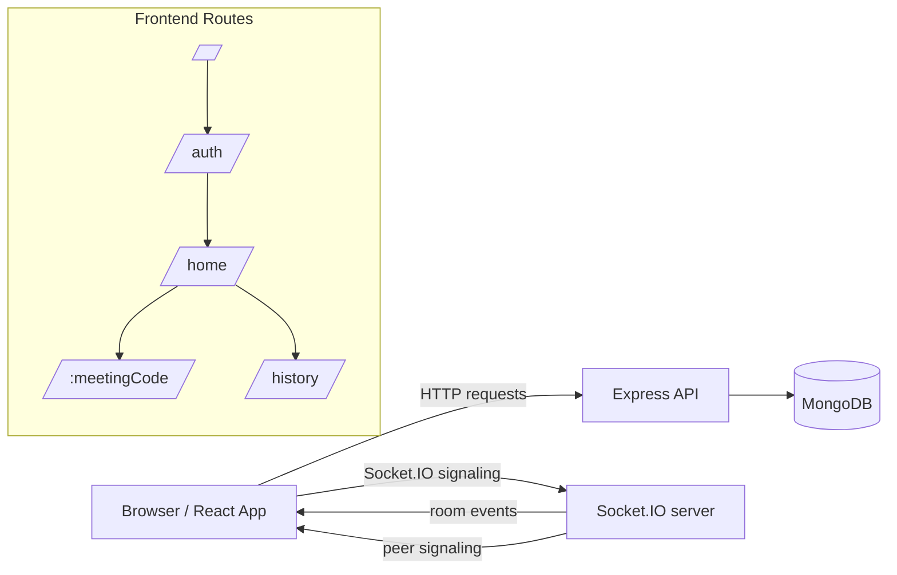

# ZoomSphere

ZoomSphere is a browser-based video meeting app with a split frontend/backend architecture. The frontend handles landing, authentication, history, and meeting-room UI, while the backend provides user management, meeting-history persistence, health checks, and Socket.IO signaling for peer-to-peer WebRTC rooms.

## At A Glance

- Frontend: Vite, React, React Router, Material UI, Axios, Socket.IO client
- Backend: Node.js, Express, Socket.IO, MongoDB, Mongoose, bcrypt
- Media path: WebRTC peer-to-peer between participants
- Signaling path: Socket.IO for room membership, offers/answers, ICE, and chat
- Persistence: MongoDB stores users and meeting history

## Architecture



### Request Flow

1. A user opens the landing page and can either go to authentication or join as a guest.
2. Registration and login requests go to the backend under `/api/v1/users`.
3. Successful login returns a random token, which the frontend stores in `localStorage`.
4. The authenticated home page accepts a meeting code and sends that code to the history API before navigation.
5. The meeting code becomes the URL for the room and the Socket.IO room identifier.
6. Socket events exchange join/leave updates, WebRTC signaling, and in-room chat messages.
7. The history page reads saved meeting activity from MongoDB and renders it for the logged-in user.

## Key Features

- User registration and login
- Browser-based token session storage using `localStorage`
- Join a meeting by code from the home page
- Peer-to-peer video and audio streams
- In-room chat with history replay for late joiners
- Mute/unmute, camera toggle, screen share, and end-call controls
- Live join/leave updates through Socket.IO
- Meeting history for authenticated users
- Backend health endpoint for deployment monitoring

## Repository Layout

```text
ZoomSphere/
├── backend/
│   ├── ecosystem.config.js
│   ├── package.json
│   └── src/
│       ├── app.js
│       ├── constants.js
│       ├── index.js
│       ├── controllers/
│       │   ├── socketManager.js
│       │   └── user.controller.js
│       ├── db/
│       │   └── index.js
│       ├── models/
│       │   ├── meeting.model.js
│       │   └── user.model.js
│       └── routes/
│           └── users.routes.js
└── frontend/
    ├── environment.js
    ├── package.json
    └── src/
        ├── App.jsx
        ├── contexts/
        │   ├── AuthContext.js
        │   └── AuthProvider.jsx
        ├── pages/
        │   ├── landing.jsx
        │   ├── authentication.jsx
        │   ├── home.jsx
        │   ├── history.jsx
        │   └── VideoMeet.jsx
        ├── styles/
        │   └── videoComponent.module.css
        └── utils/
            └── withAuth.jsx
```

## Frontend App Structure

The frontend is a single-page app routed with React Router.

- `/` renders the landing page.
- `/auth` renders login and registration.
- `/home` is the authenticated room-join dashboard.
- `/history` shows saved meeting activity.
- `/:meetingCode` opens the meeting room.

Authentication is handled client-side. The app does not use a server session; it stores the token in `localStorage`, exposes auth helpers through `AuthProvider`, and protects the home page with `withAuth`.

### Frontend Pages

- `landing.jsx`: entry screen and guest/auth navigation.
- `authentication.jsx`: registration and login form.
- `home.jsx`: meeting-code entry, logout, and history navigation.
- `history.jsx`: rendered meeting history cards.
- `VideoMeet.jsx`: WebRTC room, chat, and call controls.

## Backend Architecture

The backend is organized around three responsibilities:

- HTTP API for registration, login, and meeting history
- MongoDB persistence for users and meeting activity
- Socket.IO signaling and room state for live meetings

### Health Check

- `GET /healthz` returns `status`, `uptime`, and the current socket client count.

### User API

Base path: `/api/v1/users`

| Method | Path | Purpose |
| --- | --- | --- |
| POST | `/register` | Create a new user |
| POST | `/login` | Verify credentials and issue a token |
| POST | `/add_to_activity` | Store a meeting code in the user history |
| GET | `/get_all_activity?token=...` | Read meeting history for the token owner |

### Socket Events

| Event | Direction | Purpose |
| --- | --- | --- |
| `join-call` | client -> server | Join a Socket.IO room for the meeting |
| `user-joined` | server -> clients | Notify room members that a user joined |
| `signal` | both ways | Exchange WebRTC SDP and ICE data |
| `chat-message` | both ways | Send and replay room chat messages |
| `user-left` | server -> clients | Notify room members that a socket disconnected |
| `room-full` | server -> client | Reject joins when the room capacity is reached |
| `room-error` | server -> client | Report invalid room state |

### Room Behavior

- Room state is held in memory inside `socketManager.js`.
- Each room tracks participants and chat messages.
- Room capacity defaults to 12 participants and can be changed with `MAX_PARTICIPANTS_PER_ROOM`.
- Chat history defaults to 100 messages and can be changed with `MAX_ROOM_MESSAGE_HISTORY`.
- Messages are replayed to users when they join the room.
- Room state is deleted when the last participant leaves.

## Data Model

### User

- `name`: display name
- `username`: unique login identifier
- `password`: bcrypt-hashed password
- `token`: random session token generated at login

### Meeting

- `user_id`: username associated with the record
- `meetingCode`: room code the user joined
- `date`: timestamp for the history item

## Local Setup

### Prerequisites

- Node.js 18 or newer
- npm
- MongoDB instance

### Backend

```bash
cd backend
npm install
npm run dev
```

### Frontend

```bash
cd frontend
npm install
npm run dev
```

## Environment Variables

### Backend

The backend expects these environment variables from `.env`.

| Variable | Purpose |
| --- | --- |
| `MONGO_URI` | MongoDB connection string prefix |
| `PORT` | HTTP server port |
| `CORS_ORIGIN` | Optional comma-separated allowlist for HTTP CORS |
| `SOCKET_CORS_ORIGIN` | Optional comma-separated allowlist for Socket.IO CORS |
| `MAX_PARTICIPANTS_PER_ROOM` | Optional room capacity override |
| `MAX_ROOM_MESSAGE_HISTORY` | Optional chat history limit override |

### Frontend

The frontend currently reads its backend URL from `frontend/environment.js`.

- In the current code, production mode is enabled by default.
- The file points to the deployed backend URL.
- Switch it to localhost when running the app locally.

## Scripts

### Backend

- `npm run dev`: start the backend with nodemon
- `npm start`: start the backend with Node
- `npm run prod`: production entrypoint used by the current package scripts

### Frontend

- `npm run dev`: start the Vite dev server
- `npm run build`: build the frontend for production
- `npm run lint`: run ESLint
- `npm run preview`: preview the production build

## Operational Notes

- WebRTC carries the media streams; the backend does not proxy audio or video.
- Socket.IO is used only for signaling, chat, and room membership.
- The current signaling layer uses the browser-side WebRTC APIs and a public STUN configuration in the meeting component.
- Login issues a random hex token rather than a JWT.
- The frontend stores that token in `localStorage` and reuses it for history requests.
- Meeting history is created when a logged-in user joins a room from the home page.
- `frontend/src/pages/VideoMeet.jsx` contains the main room logic for media, chat, and call controls.

## Testing

- Frontend test tooling is available through Vitest and Testing Library.
- `frontend/src/main.test.jsx` is the current browser-facing test entry point.
- The backend does not currently include a dedicated automated test suite.

## Contributor Notes

- Keep the backend API contract aligned with `frontend/src/contexts/AuthProvider.jsx`.
- Keep room-signaling changes in `backend/src/controllers/socketManager.js` synchronized with `frontend/src/pages/VideoMeet.jsx`.
- If you change the backend base URL, update `frontend/environment.js` at the same time.
- If you add persisted meeting metadata, update `backend/src/models/meeting.model.js` and the history UI together.

## Known Gaps

- There is no `.env.example` file yet.
- There is no TURN server configured yet, so NAT traversal may be limited in restrictive networks.
- Room state is in memory, so active rooms and chat history reset when the backend restarts.
- The frontend backend URL is still hard-coded in `frontend/environment.js`.

## Next Improvements

- Add a `.env.example` file for backend and frontend configuration.
- Add a TURN server for more reliable media connectivity.
- Add automated tests for auth, history, and meeting-room flows.
- Replace the hard-coded deployment URL in `frontend/environment.js` with environment-based configuration.